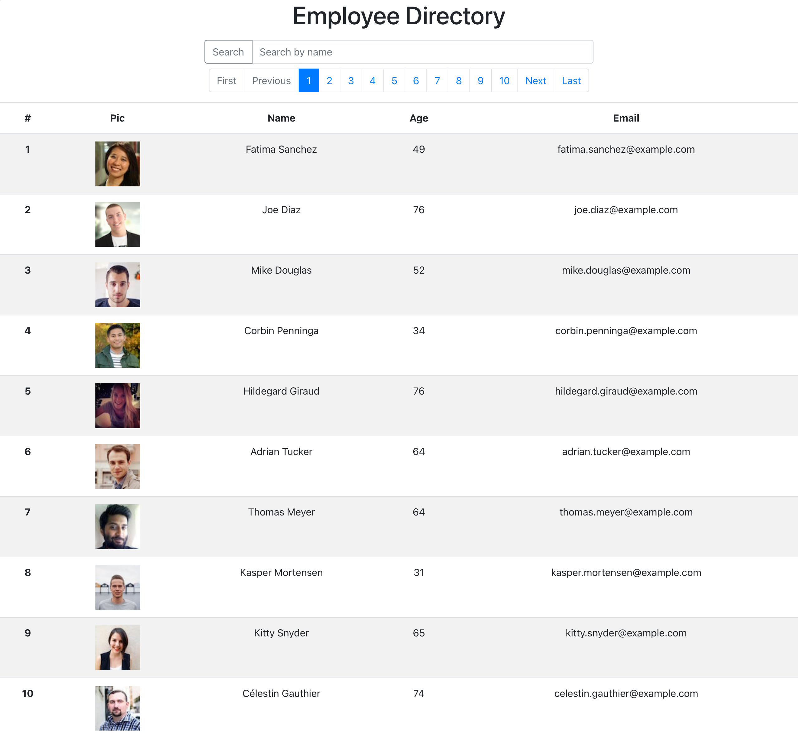

<h1 align="center">Employee Directory</h1>

 

## Description 
A web application that lists all employees in one directory using React. The user can search employees by their first or last name, or sort the employees by their phone number or email address.

 

## Screenshot

  

## Table of Contents

- [Description](#description)
- [Installation](#installation)
- [Usage](#usage)
- [License](#license)
- [Contribution](#contributing)
- [Tests](#tests)
- [Questions](#questions)

## Installation
Users can view the deployed project [here](https://garychen513.github.io/employee_directory/). If you intend to iterate on the project, besides downlodaing the repo to your machine, be sure to run `npm install` in the root diractory and to also have MongoDB installed and ready.

## Usage
This React-based app demonstrates an employee directory that can be searched and sorted. The directory is filled via an API call to Random User Generator and includes photo, title, name, gender, age, e-mail and mobile phone number. Entering text into the search box will dynamically search all fields and filter those who match the entered text. The directory can be sorted by name or by age, as indicated by the change in cursor.

## License
 
This application is covered by the MIT license.

## Contributing
[Gary Chen](https://github.com/GaryChen513)

## Tests
no

## Questions
Contact me with any question: [Github](https://github.com/GaryChen513), 
[Email](mailto:garychen19970513@gmail.com)
